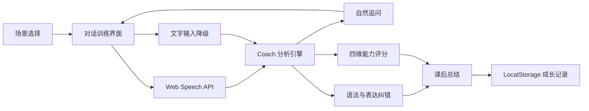

# FluentLoop - AI 英语口语陪练

FluentLoop 是一款面向真实交流场景的英语口语练习工具。它通过场景化角色扮演、浏览器实时语音、回答后智能纠错和可量化课后报告，帮助用户从“知道怎么说”走向“能够自然说出来”。

> Demo 视频：待录制后将可访问链接更新在此处。

## 在线体验

这是一个零依赖 Web 应用，克隆后可直接运行：

```bash
npm start
```

打开 `http://localhost:4173`。推荐使用最新版 Chrome 或 Edge，以体验实时英语语音识别和语音合成。

## 核心功能

- **场景选择**：覆盖求职面试、餐厅点餐、工作会议、旅行问路，并为不同 CEFR 难度设置目标。
- **自然追问**：AI Coach 根据回答长度、礼貌表达和因果表达动态回应，而不是固定脚本播放。
- **实时语音对话**：基于 Web Speech API 实现英语语音识别与角色语音合成，无需 API Key。
- **适时纠错**：不在用户说话中途打断，回答结束后集中展示语法和表达建议。
- **可信语音评估**：文字输入不生成发音分；语音输入展示明确标记的浏览器清晰度代理，支持接入专业音素级评测。
- **录音回放**：训练结束后可回听本次原始录音，复盘停顿、语速和表达清晰度。
- **课后总结**：展示综合得分、对话轮数、单词数、语速和纠错数量，并给出下一步建议。
- **成长记录**：在浏览器本地保存最近练习结果，形成持续学习反馈。
- **文字降级方案**：无法使用麦克风时仍能完整体验全部产品流程。

## 产品创新点

### 1. “不中断表达”的反馈时机

口语练习最重要的是保持表达意愿。FluentLoop 在用户说完后再给反馈，既避免实时纠错带来的挫败感，也让建议与刚完成的表达保持强关联。

### 2. 可解释的量化反馈

分数不是黑盒结果。系统同时展示 WPM、单词数、填充词和具体纠错建议，让用户知道分数为何变化、下次应该怎么练。

### 3. 零门槛演示

语音链路默认使用浏览器能力，避免因 API Key、网络额度或服务过期导致评委无法复现。架构保留了替换真实 LLM 和专业发音评测服务的扩展空间。

## 技术架构



## 评分设计

| 指标 | 当前 MVP 计算依据 | 可扩展方向 |
| --- | --- | --- |
| 流利度 | 语速与填充词数量 | 停顿位置、连续发音时长 |
| 语法 | 规则命中数量 | LLM 语境化评估 |
| 词汇 | 去重词数与回答长度 | CEFR 词汇等级、搭配丰富度 |
| 语音清晰度 | 仅语音输入；识别置信度、音频信号质量和有效发声比例，并明确标记为代理指标 | 可替换专业服务返回音素、重音与语调 |

文字输入不会生成发音或语音清晰度分数。浏览器清晰度代理不代表音素、重音、语调或口音准确度。

## 项目结构

```text
.
├── index.html            # 应用入口
├── server.js             # 零依赖本地静态服务
├── src/
│   ├── app.js            # 页面状态与交互流程
│   ├── coach.js          # 对话、纠错与评分引擎
│   ├── data.js           # 场景和规则数据
│   └── styles.css        # 响应式视觉系统
├── test/
│   └── coach.test.js     # 核心逻辑自动测试
└── docs/
    ├── ARCHITECTURE.md
    └── DEMO_SCRIPT.md
```

## 测试

```bash
npm test
```

手动验收建议：

1. 从首页进入任意场景。
2. 使用“填入演示回答”快速触发对话和纠错。
3. 使用 Chrome / Edge 麦克风完成一轮英语回答。
4. 验证 AI Coach 语音播放、实时评分、表达建议。
5. 结束练习，检查课后报告与首页成长记录。

## 第三方依赖与原创说明

- 运行时无第三方 JavaScript 库或框架。
- 使用浏览器标准能力：Web Speech API、Speech Synthesis API、LocalStorage。
- 使用 MediaRecorder 与 Web Audio API 采集真实音频信号并提供本地录音回放；默认不上传音频。
- 页面设计、场景数据、对话逻辑、评分逻辑、纠错规则、报告系统及全部代码均为本项目原创实现。
- 浏览器语音识别的可用性取决于浏览器和网络环境。

## 后续规划

- 接入实时大模型，实现更开放的角色对话与语境化纠错。
- 接入音素级发音评测，展示具体单词发音问题。
- 增加复述任务、错题复练和个性化学习计划。
- 增加教师端能力报告与分享链接。
