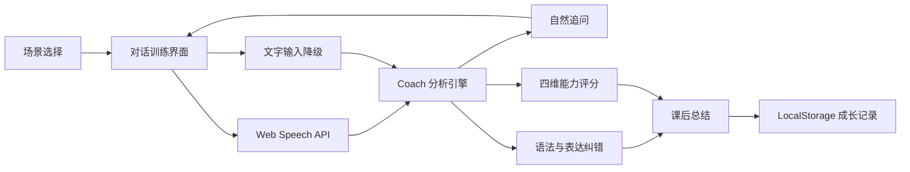

# FluentLoop - AI 英语口语陪练

[](https://github.com/ZhaoHaoYu001/ai-/actions/workflows/check.yml)

FluentLoop 是一款面向真实交流场景的英语口语练习工具。它通过场景化角色扮演、浏览器实时语音、回答后智能纠错和可量化课后报告，帮助用户从“知道怎么说”走向“能够自然说出来”。

> Demo 视频：待录制后将可访问链接更新在此处。

> AI 模式：配置服务端 Anthropic Messages API 兼容凭据或 `OPENAI_API_KEY` 后，Coach 会基于最近对话上下文生成角色追问、语境化纠错和表达反馈；未配置或请求失败时，界面会明确标记并降级为离线规则模式。

## 在线体验

这是一个零依赖 Web 应用，克隆后可直接运行：

```bash
npm start
```

启用真实 AI 对话与纠错：

```powershell
$env:ANTHROPIC_BASE_URL="https://your-compatible-endpoint/anthropic"
$env:ANTHROPIC_AUTH_TOKEN="your-token"
$env:ANTHROPIC_MODEL="mimo-v2.5"
npm.cmd start
```

也可使用常见的 `ANTHROPIC_API_KEY` 环境变量替代 `ANTHROPIC_AUTH_TOKEN`。
为保证口语通话响应速度，GLM 模型默认关闭深度思考，并将单轮 AI 输出限制为
800 tokens。可通过 `AI_THINKING=enabled` 重新开启思考，或通过
`AI_MAX_TOKENS` 调整输出上限；开启深度思考会显著增加通话等待时间。

也可使用 OpenAI Responses API：

```powershell
$env:OPENAI_API_KEY="your-api-key"
$env:OPENAI_MODEL="gpt-5.4-mini"
npm.cmd start
```

启用真实单词、音素、重音与韵律评测：

```powershell
$env:AZURE_SPEECH_KEY="your-speech-resource-key"
$env:AZURE_SPEECH_REGION="eastus"
npm.cmd start
```

同一组 Azure Speech 配置也会启用服务端语音转写兜底。当浏览器自带
`SpeechRecognition` 没有返回文字时，项目会在用户结束回答后上传本轮
16 kHz WAV 录音并自动完成转写。

未配置 Azure Speech 时，服务端会自动使用本地 Whisper Tiny English
模型转写录音。模型在第一次语音提交时下载到本机缓存，之后可离线使用；
因此浏览器实时语音识别不可用时，仍可完成语音对话训练。
默认从 `https://hf-mirror.com/` 下载模型，也可通过 `HF_ENDPOINT` 指定其他
Hugging Face 兼容模型镜像。

在其他电脑首次运行本地 Whisper：

```powershell
git clone git@github.com:ZhaoHaoYu001/ai-.git fluentloop
cd fluentloop
npm install
npm.cmd start
```

必须在包含 `package.json` 的项目目录中运行 `npm install`。打开
`http://localhost:4173`，进入任意场景并完成一轮英语录音。第一次提交
录音时请保持网络连接并等待模型下载；下载完成后系统会自动继续转写，无需
手动移动或配置模型文件。可访问 `http://localhost:4173/health`，确认返回
`"transcription":true` 和 `"transcriptionProvider":"local-whisper"`。
后续重新启动项目会直接复用本机缓存；如需更换下载镜像，可在启动前设置
`$env:HF_ENDPOINT="https://your-huggingface-mirror/"`。

服务启动后会在后台预热本地 Whisper，建议看到启动日志后再打开练习页面。
短录音使用无分块快速推理，超过 20 秒的录音才会自动分块处理。

详细接口、隐私与降级策略见 `docs/AI_COACH.md` 和 `docs/AZURE_PRONUNCIATION.md`。

打开 `http://localhost:4173`。推荐使用最新版 Chrome 或 Edge，以体验实时英语语音识别和语音合成。

## 核心功能

- **场景选择**：覆盖求职面试、餐厅点餐、工作会议、旅行问路，并为不同 CEFR 难度设置目标。
- **自然追问**：AI Coach 根据回答长度、礼貌表达和因果表达动态回应，而不是固定脚本播放。
- **语境化 AI 对话与纠错**：配置服务端模型后，Coach 会读取最近对话和场景目标，生成不重复的角色追问，并返回结构化语法、词汇与表达建议。
- **稳定半双工语音引擎**：AI 与练习者交替说话，避免扬声器回声污染录音；浏览器识别服务重连不会拆散回答，服务不可用时自动使用本轮 WAV 录音转写。
- **抗杂音自动提交**：只有持续有效人声或实时转写会启动回答结束检测；短杂音、碰麦声和短思考停顿不会立即提交，确认静音约 2.4 秒后才进入下一轮。
- **自适应轮次结束**：已有至少 8 个实时转写单词且持续表达超过 4 秒时，静音结束窗口会从 2.4 秒缩短到约 1.8 秒；短回答或无转写时继续使用更稳妥的 2.4 秒窗口。
- **AI 语音电话模式**：进入场景后自动接通，AI 说完即自动聆听；本地 VAD 确认约 750ms 持续有效人声、回答至少持续 2.5 秒，并在静音约 2.4 秒后提交回答，AI 回复后继续下一轮。短杂音和短思考停顿不会立即触发提交；用户仍可手动结束本轮、文字降级或挂断生成报告。
- **录音中回答支架**：每个场景持续展示当前问题、正确句型开头、关键词和 3 条可选完整回答示例，避免练习者因没有参考而冷场，同时不覆盖或自动提交正在录制的回答。
- **上下文实时回答建议**：AI 每轮生成追问时同步生成针对当前问题的句型开头、关键词和自然示例；不额外发起请求。AI 不可用时，离线规则也会根据问题意图切换建议，并补齐三种不同回答思路。
- **可编辑示例与草稿保持**：点击任一回答示例即可填入输入框并继续修改；通话状态变化、语音播放结束或界面重新渲染时，尚未发送的回答草稿不会丢失。
- **清晰的对话工作区**：Coach 与练习者消息、回答建议、固定输入区和发送操作具有明确视觉层级，并为桌面端与移动端分别优化示例布局。
- **非阻塞语音启动**：点击开始后立即进入文字转写，麦克风录音与发音评测链路并行初始化；权限弹窗或设备启动缓慢不会再阻塞回答录入。
- **流式 AI、容错与延迟观测**：AI 模式转发模型增量事件，并展示首字节、AI、发音评测和本轮总延迟；短暂网络、限流或服务端错误会自动重试一次，仍失败时明确说明已切换到离线教练。
- **适时纠错**：不在用户说话中途打断，回答结束后集中展示语法和表达建议。
- **可信纠错过滤**：AI 纠错必须引用用户本轮回答中的真实原文、产生有效改写并提供理由；重复、无变化或与回答无关的建议会被过滤，每轮最多展示两条重点建议。
- **专业发音评测**：配置 Azure Speech 后展示准确度、流利度、完整度、韵律、具体单词和 IPA 音素问题；未配置时明确降级为浏览器清晰度代理。
- **可操作发音练习**：专业评测会优先指出低分单词与音素并给出复练动作；浏览器代理会根据收音质量、语音活跃度和转写置信度提供诚实的录音与表达建议。
- **录音回放**：训练结束后可回听本次原始录音，复盘停顿、语速和表达清晰度。
- **课后总结**：展示综合得分、对话轮数、单词数、语速和纠错数量，并给出下一步建议。
- **可量化成长目标**：课后按流利度、语法、词汇和发音对比最近练习均值，显示具体分数变化，并为最弱维度生成下一次可验证目标。
- **个性化学习洞察**：识别本次优势、重点能力、高频错误、历史趋势和下一次复练目标。
- **成长记录**：在浏览器本地保存最近练习结果，形成持续学习反馈。
- **文字降级方案**：无法使用麦克风时仍能完整体验全部产品流程。

## 产品创新点

### 1. “不中断表达”的反馈时机

口语练习最重要的是保持表达意愿。FluentLoop 在用户说完后再给反馈，既避免实时纠错带来的挫败感，也让建议与刚完成的表达保持强关联。

### 2. 可解释的量化反馈

分数不是黑盒结果。系统同时展示真实回答时长、WPM、单词数、填充词、纠错数量、语音证据等级和评分可信度，让用户知道分数为何变化、下次应该怎么练。短回答会被标记为低可信度，也不会因人为最低分而获得虚高结果。

### 3. 零门槛演示

语音链路默认使用浏览器能力，避免因 API Key、网络额度或服务过期导致评委无法复现。架构保留了替换真实 LLM 和专业发音评测服务的扩展空间。

## 技术架构



## 评分设计

| 指标 | 当前 MVP 计算依据 | 可扩展方向 |
| --- | --- | --- |
| 流利度 | 语速与填充词数量 | 停顿位置、连续发音时长 |
| 语法 | 规则命中数量 | LLM 语境化评估 |
| 词汇 | 去重词数与回答长度 | CEFR 词汇等级、搭配丰富度 |
| 语音清晰度 | 仅语音输入；识别置信度、音频信号质量和有效发声比例，并明确标记为代理指标 | 可替换专业服务返回音素、重音与语调 |

文字输入不会生成发音或语音清晰度分数。浏览器清晰度代理不代表音素、重音、语调或口音准确度。

## 项目结构

```text
.
├── index.html            # 应用入口
├── server.js             # 静态服务与受保护的 AI Coach 接口
├── ai-service.js         # Anthropic-compatible / OpenAI 服务端适配器
├── pronunciation-service.js # Azure Speech 发音评测适配器
├── src/
│   ├── app.js            # 页面状态与交互流程
│   ├── ai-coach.js       # 浏览器 AI 客户端与离线降级
│   ├── coach.js          # 对话、纠错与评分引擎
│   ├── data.js           # 场景和规则数据
│   ├── progress.js       # 成长日历聚合
│   ├── speech-assessment.js # 发音评测证据与适配器
│   ├── voice.js          # 实时转写、翻译与录音采集
│   └── styles.css        # 响应式视觉系统
├── test/                 # 单元与服务集成测试
└── docs/
    ├── ARCHITECTURE.md
    ├── DEMO_SCRIPT.md
    └── SUBMISSION_CHECKLIST.md
```

## 测试

```bash
npm run check
npm run test:e2e
```

`npm run test:e2e` 使用真实 Chromium 自动验证完整文字训练流程、麦克风权限拒绝降级和移动端核心布局。

手动验收建议：

1. 从首页进入任意场景。
2. 使用“填入纠错示例”快速触发对话和纠错；进入电话式语音通话后验证回答支架始终可见。
3. 点击三条回答示例中的任意一条，确认示例进入输入框、可以继续编辑，并在通话状态变化后保持草稿。
4. 使用 Chrome / Edge 麦克风完成一轮英语回答。
5. 验证 AI Coach 语音播放、实时评分、表达建议；服务异常时确认页面明确显示离线降级原因。
6. 结束练习，检查课后报告、可见的“再练一次”按钮与首页成长记录。

## 评审快速复现

1. 运行 `npm start`，打开 `http://127.0.0.1:4173`。
2. 选择“求职面试”，点击“填入纠错示例”并发送，验证离线纠错和评分。
3. 在 Chrome / Edge 进入场景，等待 AI 开场后直接回答，验证停顿自动提交、连续追问、手动结束本轮和清晰度代理。
4. 可选配置 Anthropic-compatible 凭据或 `OPENAI_API_KEY`，验证上下文追问和语境化反馈。
5. 结束练习，验证录音回放、个性化课后洞察和成长日历。

### Demo 前稳定性检查

```powershell
npm.cmd run check:all
npm.cmd start
```

1. 打开 `http://127.0.0.1:4173/health`，确认 AI、发音评测和转写提供方与演示计划一致。
2. 提前完成本地 Whisper 首次模型下载与预热，避免录制时等待。
3. 连续完成至少三轮真实 AI 对话，确认模型回复稳定；暂时关闭 AI 凭据后再验证离线降级提示。
4. 用桌面端和移动端各检查一次三条回答示例、输入草稿和课后报告按钮。
5. 录制完成后，从无登录状态打开 Demo 视频链接并完整播放一次，再替换 README 顶部的待录制提示。

完整提交检查表见 [`docs/SUBMISSION_CHECKLIST.md`](docs/SUBMISSION_CHECKLIST.md)。

## 持续交付记录

核心能力均通过单一职责 PR 交付，并在合并前通过 GitHub Actions：

- [PR #9](https://github.com/ZhaoHaoYu001/ai-/pull/9)：质量门禁与 PR 模板
- [PR #10](https://github.com/ZhaoHaoYu001/ai-/pull/10)：实时语音控制
- [PR #11](https://github.com/ZhaoHaoYu001/ai-/pull/11)：可信语音评测
- [PR #12](https://github.com/ZhaoHaoYu001/ai-/pull/12)：上下文 AI Coach
- [PR #13](https://github.com/ZhaoHaoYu001/ai-/pull/13)：服务端安全边界
- [PR #14](https://github.com/ZhaoHaoYu001/ai-/pull/14)：可解释评分
- [PR #15](https://github.com/ZhaoHaoYu001/ai-/pull/15)：个性化课后报告
- [PR #16](https://github.com/ZhaoHaoYu001/ai-/pull/16)：对话状态韧性
- [PR #18](https://github.com/ZhaoHaoYu001/ai-/pull/18)：Azure 单词与音素级发音评测
- [PR #19](https://github.com/ZhaoHaoYu001/ai-/pull/19)：流式 AI 与端到端延迟指标
- [PR #20](https://github.com/ZhaoHaoYu001/ai-/pull/20)：真实 Chromium E2E 质量门禁
- [PR #37](https://github.com/ZhaoHaoYu001/ai-/pull/37)：演示可靠性、AI 重试与可见降级反馈
- [PR #38](https://github.com/ZhaoHaoYu001/ai-/pull/38)：三条可选回答示例与对话工作区优化

## 第三方依赖与原创说明

- 产品运行时使用 `@huggingface/transformers` 提供本地 Whisper 录音转写；开发测试使用 `@playwright/test`。
- 使用浏览器标准能力：Web Speech API、Speech Synthesis API、LocalStorage。
- 使用 MediaRecorder 与 Web Audio API 采集真实音频信号并提供本地录音回放；默认不上传音频。
- 可选使用 Anthropic Messages API 兼容服务（已验证 `mimo-v2.5`）或 OpenAI Responses API 提供上下文角色对话与结构化语言反馈；API Key 仅保存在本地服务端环境变量中。
- 可选使用 Azure Speech Pronunciation Assessment 提供单词、音素、重音和韵律反馈；密钥仅保存在本地服务端环境变量中。
- 未配置 Azure Speech 时，本地 Whisper Tiny English 为英语录音提供无需 API Key 的服务端转写兜底。
- 页面设计、场景数据、对话逻辑、评分逻辑、纠错规则、报告系统及全部代码均为本项目原创实现。
- 浏览器语音识别的可用性取决于浏览器和网络环境。

## 当前边界与后续规划

- 当前 AI Coach 已流式转发模型输出，语音输入采用稳定的显式半双工轮次控制；后续可升级为带服务端 VAD 的 WebRTC 全双工语音链路。
- 三条回答示例用于提供表达方向而不是替代练习；用户仍应修改示例并结合真实经历完成回答。
- Azure Speech 未配置时，发音结果会明确降级为浏览器清晰度代理。
- 增加可交互的错题复练与掌握状态跟踪。
- 增加教师端能力报告与分享链接。
